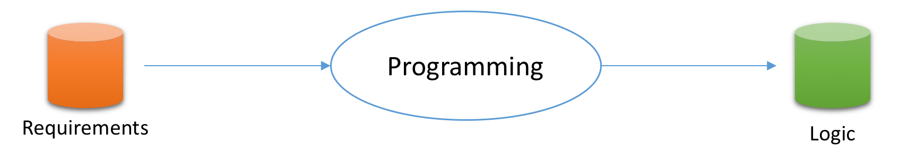
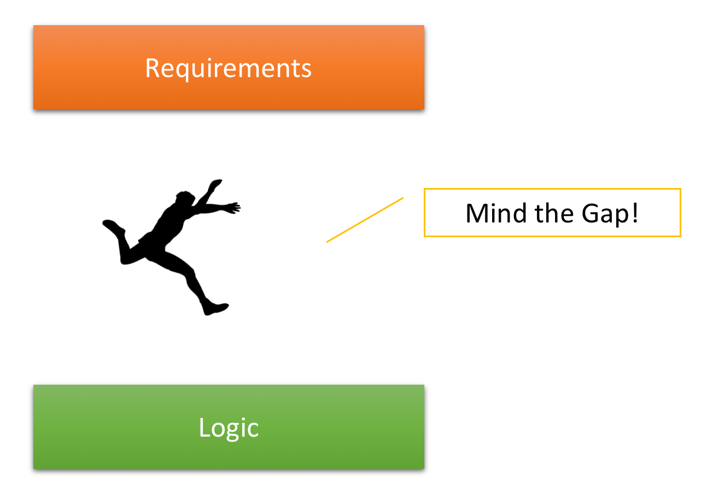

# Requirements-Logic-Gap
Warum fällt es in vielen Projekten so schwer, flüssig und nachhaltig zu arbeiten? Das beobachten wir sogar dort, wo ein Agiles Vorgehensmodell (Prozess) implementiert wurde.

Unsere Hypothese dazu: Softwareentwicklung wird zu wenig differenziert betrachtet. Zu viel Kunst, zu wenig Systematik. Die Tätigkeit "Entwicklung" wird im Grunde als Monolith empfunden: Man lernt etwas Paradigma (z.B. Objektorientierung), man lernt etwas Programmiersprache (z.B. C#, Java, Ruby & Co), man lernt etwas Technologie (z.B. WPF, MongoDB, RabbitMQ). Und dann "macht man halt". Dann beginnt das große Wurschteln.

Das Ergebnis dieser Herangehensweise ist zu ihr kongruent: es ist ein Gewurschtel, ein Monolith. Spaghetticode war vorgestern; heute sagt man vornehmer _legacy code_. Gemeint ist aber dasselbe: Code, der kaum durchschaubar ist und jeden Tag schwerer verändert werden kann.

Das ist natürlich nicht nachhaltig. So lässt sich auch nicht dauerhaft flüssig wertvoller Code herstellen.

2009 haben wir deshalb die Clean Code Developer Initiative ([clean-code-developer.de](http://clean-code-developer.de)) gegründet. Dort findest du 42 Prinzipien und Praktiken für sauberen Code, d.h. solchen, der sich länger flüssig produzieren lässt. Wir nennen das Evolvierbarkeit.

Diese Sammlung war damals eine gute Idee. Sie hat vielen Entwicklern geholfen. Doch schon bald haben wir bemerkt, dass es damit nicht genug ist. Es fehlte etwas. Das war ein _big picture_, ein Zusammenhang, ein Rahmenwerk.

Und zwar fehlte ein Rahmenwerk, das ganz am Anfang beginnt, nämlich bei der Frage: Was soll das mit der Softwareentwicklung überhaupt? Was tun wir als Programmierer eigentlich, wenn wir Software entwickeln?

Solange diese fundamentale Frage nicht ganz einfach beantwortet ist, können wir nämlich nicht wirklich beurteilen, inwiefern irgendeine Technik oder ein Prinzip usw. dazu überhaupt beiträgt.

## Von Anforderungen zur Logik
Also: Was soll das Ganze?

Es ist so selbstverständlich, dass es kaum der Erwähnung wert ist: Softwareentwicklung soll Anforderungen in Code verwandeln. Sie beginnt bei der natürlichsprachlichen Beschreibung von Funktionalitäten und Effizienzen; sie endet mit der Ablieferung von programmiersprachlichem Code, der diese Anforderungen erfüllt.

Dass es am Ende um ausführbaren Code geht, also nicht Code in einer Hochsprache wie C# oder Go ausgeliefert wird, ist eine Feinheit, die dem grundlegenden Zweck nicht widerspricht.


Der ausführbare Code ist das angestrebte Resultat, weil der in der Ausführung Verhalten gegenüber den Anwendern erzeugt, das ihnen (hoffentlich) nützt.

Anwender interagieren mit dem Code: Sie geben Daten ein, lösen Funktionalität aus, erhalten Daten als Ergebnis. Software verhält sich damit, weil sie reagiert. Die Reaktion besteht im Output. Der kann einfach nur am Bildschirm dargestellt werden oder zeigt sich in Zustandsveränderungen von Geräten.

Bis hierher klingt das selbstverständlich für dich, oder? Was sonst sollte der Zweck von Softwareentwicklung sein?

Aber lass uns nicht beim Selbstverständlichen stehenbleiben. Lass uns genauer hinschauen. Denn hier steckt der Teufel im Detail. Und wenn wir ihn dort aufgespürt haben, wirst du verstehen, warum Softwareentwicklung nicht monolithisch sein und nicht als künstlerische Veranstaltung gedacht werden darf.

Einerseits lässt sich genauer auf Anforderungen schauen. Was gibt es eigentlich für Anforderungen? Darüber lässt sich trefflich einige Zeit lang nachdenken und diskutieren. Lassen wir es einstweilen pauschal bei funktionalen und nicht-funktionalen Anforderungen. Software soll etwas tun (z.B. rechnen) und das soll sie in gewisser Weise tun (z.B. schnell).

Andererseits lässt sich genauer auf Code schauen. Was gibt es eigentlich für Code? Oder noch genauer: Ist eigentlich der gesamte Code, den du als Programmierer schreibst, dafür verantwortlich, Verhalten herzustellen?

Denk an all die Zeilen, die du täglich schreibst. Welche davon tragen dazu bei, dass Funktionalität oder Effizienz nach Geschmack des Kunden entsteht?

Die Antwort ist einfach: nur Zeilen, die [Logik](logik.md) enthalten, stellen Verhalten her.

Was Logik ist, erklären wir dir besser [auf einer eigenen Seite](logik.md). Für den hiesigen Überblick ist im Moment nur wichtig, dass das eben lediglich ein Teil des gesamten Codes ist. Und nur genau dieser Teil des Code interessiert den Kunden. Nur dafür ist er (zunächst) bereit, Geld auszugeben.

Die Transformationsaufgabe der Programmierung können wir damit genauer formulieren:



Sie soll den Input Anforderungen (requirements) in den Output Logik (logic) überführen. Nicht mehr, nicht weniger.

## Die Lücke
Nun gut, also soll die Programmierung Logik herstellen. Das machst du ja jeden Tag. Wo ist das Problem, magst du fragen.

Klar, das machen Softwareentwickler jeden Tag. Aber ist das auch einfach? Ist das geradlinig? Ist das nachvollziehbar? Entsteht dabei sauberer Code, d.h. solcher, der keinen Raubbau an der zukünftig für seine Weiterentwicklung nötigen Zeit treibt?

Leider muss darauf die Antwort ganz eindeutig Nein lauten.

Eigentlich ist dir und jedem anderen Softwareentwickler das auch bewusst. Nur glauben wir, dass daraus ungenügende Schlüsse gezogen werden.

Lass uns ein kurzes Experiment machen (oder simulieren). Mach mit, indem du Papier und Stift zur Hand nimmst.

Stufe 1: Angenommen ein Kunde bitte dich, ein Programm zu schreiben, das bei Aufruf von `greet` einfach nur *Hello, World!* ausgibt. Fällt dir dazu die [Logik](logik.md) ein?

Wir sind uns sicher, nach kurzem Zögern, ob wir das ernst meinen und ob es wirklich so simpel ist, wirst du sofort schreiben können

```
Console.WriteLine("Hello, World!");
```

Das war trivial, oder? Also weiter...

Stufe 2: Der Kunde ist zufrieden mit dem Programm, das deine Logik enthält. Er bekommt Geschmack auf mehr. Nun soll das Programm nicht länger anonym begrüßen, sondern mit Namen. Dazu muss sich der Benutzer natürlich dem Programm bekannt machen. Das tut er gleich bei Aufruf, z.B. `greet Peter`.

Wie ist es nun mit der [Logik](logik.md)? Fällt sie dir einfach ein? Kannst du sie auf dein Papier schreiben?

Bestimmt. Du bist Profi. Du kennst deine APIs. In C# könnte das so aussehen:

```
var name = Environment.GetCommandLineArgs()[1];
Console.WriteLine($"Hello, {name}");
```

Das war immer noch trivial, oder? Naja, vielleicht hast du schon einen klitzekleinen Moment gezögert. Zuerst hattest du vielleicht gedacht, dass der Name vom Programm eingelesen werden sollte. Aber dann hast du nochmal die Anforderungen studiert und gesehen, dass er als Kommandozeilenargument übergeben wird. Das macht ja schon einen Unterschied.

Einerlei. Auch die Variante mit der Frage nach dem Namen wäre von der Logik her supersimpel gewesen:

```
Console.Write("Please enter your name: ");
var name = Console.ReadLine();
Console.WriteLine($"Hello, {name}");
```

Oder vielleicht doch nicht? Hättest du jetzt schon überlegt, was passiert, wenn der Benutzer keinen Namen eingibt und nur ENTER drückt? Oder was würde passieren, wenn er einen megabytegroßen Text aus der Zwischenablage als Name einfügt? Sollten solche Fälle nicht speziell behandelt werden?

Aber lass uns nicht zu lange auf darüber grübeln. Der Kunde will schon wieder mehr.

Stufe 3: Das Programm ist der Hit! Es soll weiter ausgebaut werden. Der Kunde wünscht sich, dass die Grußformel variiert, jenachdem, wie oft ein Benutzer das Programm schon aufgerufen hat. Beim ersten Aufruf soll mit "Hello" begrüßt werden, ab dem zweiten mit "Welcome back", ab dem fünften mit "Good to see you again".

Wie steht's nun mit der reinen [Logik](logik.md) zur Herstellung dieses Verhaltens? Blitzt sie schon auf in deinem Kopf? Kannst du sie einfach runterschreiben auf deinem Blatt?

Wahrscheinlich nicht. Das ist jedenfalls immer wieder unsere Erfahrung, wenn wir mit Trainingsteilnehmern dieses Experiment machen. Niemandem fällt dazu sofort die Logik ein. Die Gründe sind vielfältig, aber im Moment nicht wichtig.

Wichtig ist allein, dass du spürst, dass selbst für sehr, sehr simple Anforderungen völlig unklar ist, wie die Logik aussieht, die das gewünschte Verhalten herstellt.

Du kannst nicht von Anforderungen zu [Logik](logik.md) springen. Niemand kann das. Logik muss entwickelt werden. Das macht den Job des Software-Entwicklers aus. Logik entsteht nicht einfach durch Intuition, sondern will erarbeitet sein.

Wir nennen das die *Requirements-Logic-Gap*, die Lücke zwischen Anforderungen und Logik. Die zu schließen, ist die zentrale Aufgabe der Programmierung.



Das merkst du auch jeden Tag am Arbeitsplatz, glauben wir. Wenn es hektisch wird, wenn der Druck steigt, schon wenn es um Schätzungen geht... dann ist alles von Logik gebannt. Denn dann geht es darum, dass Funktionalität und/oder Effizienz verbessert werden sollen. Und je schneller die Lücke übersprungen wird, desto besser.

_I've got logic on my mind..._ so könnten Kunden wie Management im Chor singen ;-) Ja, sie wollen Logik, Logik, Logik. Sie wollen, dass die Softwareentwicklung für jede Anforderung die Lücke möglichst schnell überspringt.

Und genau das versucht die Softwareentwicklung dann auch. Sie versucht zu springen.

Doch erstens ist das, wie du oben gemerkt hast, nicht leicht. Und zweitens stellt sich eher früher als später heraus, dass Logik doch nicht alles ist. Die schönste Logik nützt dir nämlich wenig, wenn sie alsbald verändert werden soll - und du dich dann in ihr nicht mehr zurecht findest. Oder sie sich deinen Veränderungen widersetzt.

Deshalb raten wir ab vom Versuch eines Sprungs. Die Lücke zwischen Anforderungen sollte vielmehr in systematischen Schritten überquert werden. Gehen, vielleicht laufen, aber nicht springen!

Willst du wissen, welche Schritte wir für notwendig halten? Es sind drei. Die sind zunächst auch nicht wirklich neu. Aber wenn du mit uns genau hinschaust, dann wirst du sehen, die haben es in sich.

Bereit? [Dann los...](schritte.md)

## Und was ist mit Objektorientierung?
Jetzt haben wir immerzu von Logik gesprochen. Da fragst du dich bestimmt, was mit der ehrwürdigen Objektorientierung ist. Geht es nicht beim Programmieren darum, Klassen zu definieren, um in denen Funktionen und Daten zusammenzufassen?

Funktionen, Klassen und Objekte haben ihren Platz. Keine Sorge, die wollen wir nicht aus dem Boot kippen. Allerdings haben sie für uns einen anderen Stellenwert. Sie stehen nicht am Anfang unserer Überlegungen, sondern kommen später hinzu. Du wirst schon sehen.

An dieser Stelle als knappe Begründung:

Anforderungen an Funktionalität oder Effizienz sind noch nie besser erfüllt worden durch Funktionen, Klassen oder Objekte. Funktionen, Klassen und Objekte sind einfach keine programmiersprachlichen Mittel, um Verhalten herzustellen. Das geschieht ausschließlich mittels [Logik](logik.md).

Deshalb tauchen Funktionen, Klassen, Objekte bisher nicht auf dem Weg ausgehend von den Anforderungen auf. Die Zeit ist immer knapp. Wir müssen uns konzentrieren bei der Softwareentwicklung. Es gilt, das Ziel scharf ins Auge zu fassen. Und das lautet: Verhalten.

Du bist immer noch verwirrt? Dann versuche, dieses Gefühl einen Moment einfach mal zu ignorieren. Gib uns noch einen Moment und schau dir an, [wie wir uns vorstellen, die Lücke zu schließen.](schritte.md)