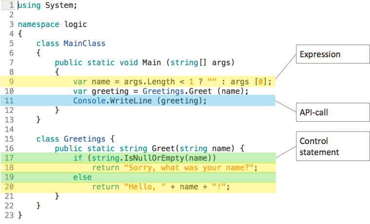

# Logik
Als Logik bezeichnen wir im Flow-Design denjenigen Code, der Verhalten herstellt.

Verhalten zeigt sich dem Anwender durch Veränderung von Zuständen. Der Zustand des Bildschirms kann sich verändern - eben stand dort noch kein Ergebnis, jetzt steht dort eines - oder der Zustand des Druckers kann sich verändern - eben war da noch kein Dokument ausgedruckt, jetzt liegt eines im Ausgabefach - oder der Zustand einer Datei kann sich ändern - eben stand in der Datei ein Datensatz, jetzt ist der verschwunden. Usw. usf.

Freunde der Funktionalen Programmierung mögen es nicht gern hören, aber es hilft nichts: Der Daseinszweck von Software besteht darin, Seiteneffekte zu erzeugen.

Seiteneffekte sind nicht zu vermeiden, Seiteneffekte sind sogar erwünscht. Ohne Seiteneffekte haben Anwender nichts davon, was immer Code sonst tun mag.

Aber das bedeutet natürlich nicht, dass Seiteneffekte an beliebiger Stelle im Code entstehen sollten. Etwas Ordnung darf schon sein. Aber das ist ein anderes Thema, ein Thema vor allem des [Entwurfs](entwurf.md).

## API-Aufrufe

Aus dieser zentralen Bedeutung von Seiteneffekten folgt schon ein erster Bestandteil von Logik: I/O.

Anweisungen, die auf Hardware lesend/schreibend zugreifen, gehören zur Logik. Dabei kann es um die Ausgabe auf Standard-Output gehen oder Dateizugriff oder eine TCP-Verbindung oder eine Datenbank oder die Ansteuerung eines Scanners usw.

Das geschieht natürlich in allen Sprachen fast ausschließlich über spezielle Bibliotheken. Deshalb fassen wir diese Logik-Kategorie weiter und nennen sie API-Aufrufe.

Beispiele aus verschiedenen Sprachen für API-Aufrufe zur Ausgabe auf der Konsole:

```
System.Console.WriteLine("Hello, World!"); // C#
printfn "Hello, World!" // F#
puts "Hello, World!" // Ruby
fmt.Println("Hello, World!") // Go
env.out.print("Hello, World!") // Pony
```

Wann immer du also in deinem Code eine Funktion aus einer Bibliothek aufrufst, die du nicht selbst geschrieben hast und deren Code du nicht pflegst, ist das Logik.

## Transformationen
Daten einlesen und dieselben Daten woanders speichern, ist zwar Logik, aber bringt den Anwender meistens nicht weiter.

Die Namen für eine Gästeliste lassen sich so sammeln:

```
var name = Console.ReadLine();
File.AppendAllText("gästeliste.txt", name)
```

Doch der Dateiinhalt lädt dann nicht zur Weiterarbeit ein:

```
PeterPaulMaria
```

Zur Logik gehört daher noch eine zweite Kategorie: Transformation. Logik verändert Daten. Ausdrücke jeder Art sind also Logik, z.B.

```
var name = Console.ReadLine();
var gasteintrag = name + "\n"
File.AppendAllText("gästeliste.txt", gasteintrag)
```

Die Operation `+` transformiert ihren Input `name` (mit Wert `"Peter"`) und `"\n"` in den Output `"Peter\n"`.

Wenn du spitzfindig bist, kannst du solche Operationen natürlich als Bibliotheksfunktionen verstehen und sie der Kategorie API-Zugriff zuschlagen. Aber wir glauben, dass es hilfreich ist, sie mehr als Bestandteil der Programmiersprache zu betrachten. Deshalb dafür eine eigene Kategorie.

## Kontrollstrukturen
Auch Anweisungen, die den Kontrollfluss steuern, verändern das Verhalten von Software:

```
if (b != 0)
  return a / b;
else
  throw new InvalidOperationException();
```

In diesem Beispiel sind gleich zwei Kontrollflussanweisungen im Spiel: das offensichtliche `if-then-else` und das weniger offensichtliche `throw`.

Wir rechnen `throw` wie auch die auffangende Anweisungen `try-catch-finally` zu den Kontrollstrukturen, weil sie mit der Ausführungsreihenfolge von Anweisungen zu tun haben.

Ganz allgemein gehören in diese Kategorie Fallunterscheidungen und Schleifen und Ausnahmebehandlung.

## Zuweisungen
Variablen bzw. ihre Zuweisungen gehören zur Logik, wenn sie verhaltensrelevant sind. Code ohne Variablen kann dasselbe Verhalten zeigen wie mit ihnen:

```
File.AppendAllText("gästeliste.txt", Console.ReadLine() + "\n")
```

Doch Variablen können zur Effizienzsteigerung eingesetzt werden. Sie ersparen dann die mehrfache Ausführung von Transformationen. Das wirkt sich auf das Softwareverhalten aus.

Ansonsten dienen Variablen oft der Erhöhung der Lesbarkeit von Logik. Da das den Kunden jedoch nur sekundär interessiert, weil es nicht laufzeitverhaltensrelevant ist, sehen wir es nicht als Unterstützung ihrer Logikzugehörigkeit. Zuweisungen stehen deshalb am Ende der Liste dessen, was Logik ausmacht.

## Logik überall
Begriffe wie Geschäftslogik (business logic) oder Domänenlogik (domain logic) oder Datenzugriffslogik (data access logic) oder Präsentationslogik (presentation logic) hast du bestimmt schon gehört. Sie tauchen in Architekturdiskussionen regelmäßig auf.

Wir hatten sie auch schon oft benutzt, ohne recht darüber nachzudenken, was darin die "Logik" zu bedeuten hatte. Es schien so offensichtlich: Es geht um Code mit fokussierter Verantwortlichkeit.

Aber halt! Warum dann "Logik" und nicht "Code"? Es könnte doch auch heißen "Domänencode" oder "Präsentationscode".

Erst als wir Logik als Untermenge von Code verstanden, machten die Begriffe wirklich Sinn. "Geschäftslogik" bezeichnet eben nur Logik im obigen Sinn. Es geht um die Logik, die "geschäftliches Verhalten" herstellt, also z.B. in einer Taschenrechnersoftware die mathematischen Operationen durchführt. Das werden vor allem Transformationen und Zuweisungen sein. Logik hingegen, die das Ergebnis anzeigt oder ein Protokoll in einer Datei führt, ist Präsentationslogik bzw. Datenzugriffslogik.

Immer geht es nur um die für eine abgegrenzte Verantwortlichkeit relevanten API-Zugriffe, Transformationen, Kontrollstrukturen und performancesteigernde Zuweisungen.



Logik ist also überall. Logik ist der Kern von Software. Alles andere in deinem Code ist... nein, nicht unnötiges Beiwerk, aber eben zumindest nicht für die Herstellung von Laufzeitverhalten zuständig.

Aber was soll dann der Rest? Wie wird der Rest - abgesehen von Kommentaren - genannt? Lies darüber mehr bei den [Modulen](module.md).