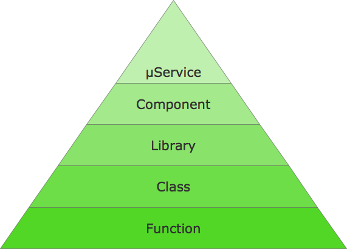
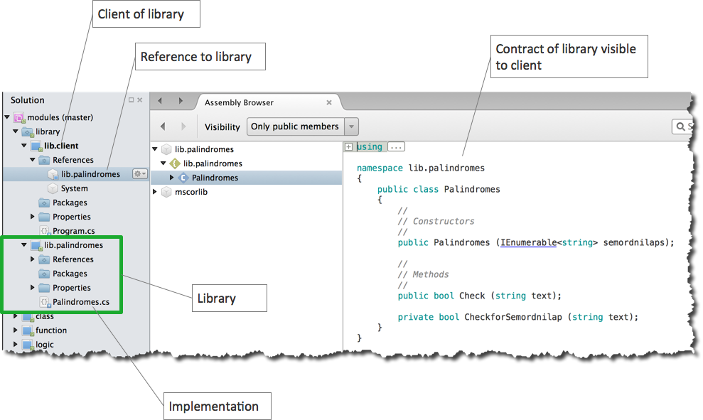
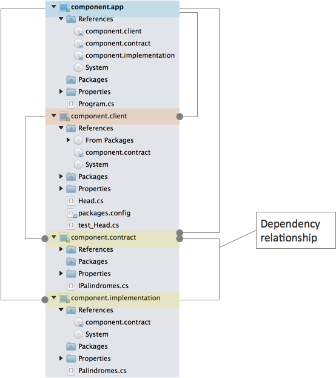
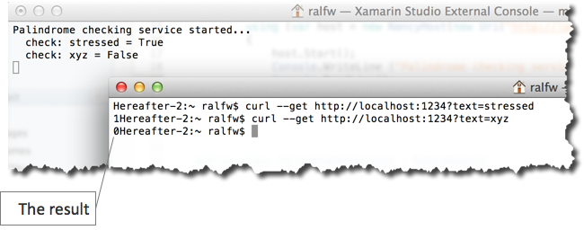
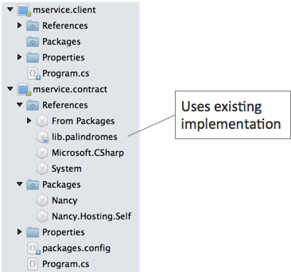
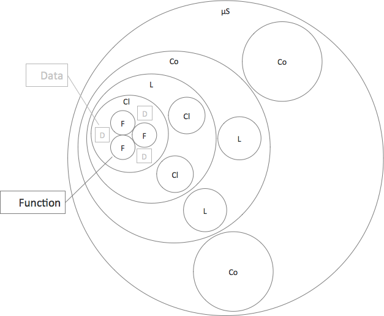

# Module
Der Begriff "Modul" ist dir bestimmt sehr geläufig. Er fällt in technischen Diskussionen immer wieder (genauso wie "Komponente"). Aber auch Vertrieb,  Marketing oder Management benutzen ihn.

Doch was bedeutet "Modul"? Könntest du eine Definition geben? Wir haben uns damit lange schwer getan. Modularisierung wird in der Literatur ja immer wieder als hochnotwendig beschworen (hier [der Klassiker von Parnas](http://sunnyday.mit.edu/16.355/parnas-criteria.html) dazu) - doch was ist das?

Wenn der Vertrieb von Modulen spricht, geht es um "verkaufbare Softwareeinheiten", z.B. ein Buchhaltungsmodul oder ein Warenkorbmodul. Module sind hier Teile von größeren Produkten. Es sind kundenrelevante Einheiten.

Wenn du als Softwareentwickler aber "Modul" sagst, dann meinst du bestimmt etwas anderes. Ob der Kunden es versteht, ist dir egal. Doch was meinst du genau mit "Modul"?

## Der Zweck von Modulen
Wir finden es wichtig, in der Softwareentwicklung eine präzise Sprache zu sprechen. Du weißt genau, was "Funktion" oder "Klasse" bedeutet. Da gibt es keine zwei Meinungen, wenn du dich mit Kollegen unterhältst. Für "Modul" oder "Komponente" oder "Service" sieht das anders aus.

Deshalb hier unser Vorschlag für eine Definition von "Modul":

> Module sind Container, die Logik über einen Kontrakt zugänglich machen, um Wandlungsfähigkeit herzustellen.

So eine kompakte Definition ist nützlich, weil du sie einfach im Kopf behalten kannst. Aber sie leuchtet vielleicht nicht unmittelbar ein. Deshalb dröseln wir sie am besten für dich auf:

* "Container": Module sind Behälter. Was in ihnen ist, ist von der Umwelt irgendwie getrennt. Module ziehen also eine Grenze.
* "Logik": Module enthalten [Logik](logik.md). Module stehen damit für Verhalten. Die Logik für ein gewisses Verhalten ist durch Module von Logik für anderes Verhalten getrennt. Je nachdem welche und wie viel Logik du in einem Modul zusammenfasst, ist dessen Zweck sehr eng umrissen und fokussiert - oder schwammig. Empfehlenswert ist es, jedes Modul nur mit einer Verantwortlichkeit zu betrauen (Single Responsibility Principle (SRP)).
* "Kontrakt": Damit die Logik in Modulen Verhalten herstellen kann, muss sie gezielt angesprochen werden können. Welche "Einsprungpunkte" es gibt, welche Daten übergeben werden müssen und welche geliefert werden, beschreiben Modulkontrakte. Kontrakte ziehen konkret die Grenzen um Module. Sie definieren, was von außen sichtbar ist und was nicht.
* "Wandlungsfähigkeit": Warum der Aufriss mit Modulen? Wenn sie nichts zum Verhalten beitragen, hat der Kunde doch kein (direktes) Interesse an ihnen. So richtig das ist, es greift zu kurz. Der Kunde hat nämlich noch ein weiteres Interesse jenseits von Funktionalität und Effizienz. Er möchte, dass sich Software über unbestimmt lange Zeiträume stets leicht an neue Anforderungen anpassen lässt. Sie soll wandlungsfähig sein. Und genau dabei helfen Module. Sie entkoppeln Logik, sie geben Logik Bedeutung, mit ihnen lässt sich Logik auf unterschiedliche Abstraktionsebenen legen.

Das ist es, was die Definition direkt sagt. Darüber hinaus lässt sich aus ihr aber auch noch herauslesen:

* Module sind nicht die einzigen Container, sonst müssten sie nicht speziell als solche bezeichnet werden. Oder es bräuchte nur den Begriff "Container". Logik kann in weiteren Arten von Containern also auch noch zu anderen Zwecken verstaut werden.
* Container können nicht nur Logik enthalten, sonst müsste die nicht in der Definition betont werden.

Über andere Container und Inhalte wollen hier im Augenblick aber nicht sprechen. Das würde zu weit führen. Lass uns auf Module konzentrieren. Davon gibt es nämlich genug Arten.

## Module auf verschiedenen Ebene
Ein Oberbegrif wie "Modul" lohnt sich nur, wenn unter ihm mehrere Dinge versammelt werden sollen. Das ist bei Modulen auch der Fall. Denn es gibt nicht nur eine Art von Modul, sondern mehrere und auf unterschiedlichen Ebenen.



Zur Motivation ein bisschen Logik:

```
// build string to check
var text = string.Join ("", args);

// check if string is a palindrome
// https://en.wikipedia.org/wiki/Palindrome
text = text.Replace (" ", "");
var txet = string.Join ("", text.ToCharArray ().Reverse ());
var isPalindrome = StringComparer.CurrentCultureIgnoreCase.Compare (text, txet) == 0;

// output result
Console.WriteLine ("'{0}' {1}", text, isPalindrome ? "is a palindrome" : "is not a palindrome");
```

Erkennst du, worum es geht? Ohne Kommentare und halbwegs sprechende Variablennamen fiele es dir bestimmt schwer. Dennoch: Wie ist der mittlere Teil, die Domänenlogik, "zu bedienen"?

Mit Modulen lässt sich Verständlichkeit besser erreichen. Denn Module geben nicht nur Bedeutung, sondern kapseln die Logik auch und geben ihr einen klaren Kontrakt. Verwirrende Details werden vor Nutzern verborgen. Und Nutzung (gar Wiederverwendung) wird sehr einfach.

### Funktionen
Die kleinsten Module sind Funktionen (oder allgeminer: Unterprogramme). Sie enthalten Logik direkt. Sie werden daher meist mit einem Namen versehen, der eine Aktivität ausdrückt. Wenn du den liest, sollte dir sofort klar sein, was die Aufgabe der Funktion ist. Das SRP lässt grüßen.

Hier eine Funktion für die Domänenlogik des obigen Beispiels:

```
static bool CheckForPalindrome(string text) {
	// https://en.wikipedia.org/wiki/Palindrome
	text = text.Replace (" ", "");
	var txet = string.Join ("", text.ToCharArray ().Reverse ());
	return StringComparer.CurrentCultureIgnoreCase.Compare (text, txet) == 0;
}
```

Der Funktionsname ersetzt einen Kommentar. Und am Aufrufort wird der Code gleich viel übersichtlicher:

```
// build string to check
var text = string.Join ("", args);

var isPalindrome = CheckForPalindrome (text);

// output result
Console.WriteLine ("'{0}' {1}", text, isPalindrome ? "is a palindrome" : "is not a palindrome");

```

Kaum auszudenken, wenn auch noch die anderen Logik-Teile in eigene Funktionen verpackt würden! Der gesamte Verarbeitungsprozess würde dann womöglich so aussehen:

```
var text = Build_string_to_check_from_commandline(args);
var isPalindrome = CheckForPalindrome (text);
Print_result(text, isPalindrome);
```

Übersichtlich, oder? Mit einem Blick erfasst du, worum es geht und in welchen Schritten das Gesamtverhalten hergestellt wird.

In Funktionsmodulen bilden Kontrakt und Implementation eine Einheit. Die Signatur steht dort, wo die Logik zu finden ist.

In einigen Programmiersprachen muss Logik zwar nicht zwangsläufig in einem Modul stehen, doch das macht ohnehin nur Sinn, solange es sehr überschaubare Logik ist. Insofern würden wir sagen: Alle Logik muss in Module, d.h. primär in Funktionen verpackt werden. Ohne Funktionen gibt es keine Wiederverwendbarkeit - einmal schreiben, oft nutzen -. Ohne Funktionen gibt es auch keine _composability_. Sie sind die kleinsten Bedeutungsbausteine, aus denen Software zusammengesetzt werden kann.

### Klassen
Software bestehend nur aus Logik wird schnell unübersichtlich. Software, in der Logik in Funktionen gekapselt ist, wird ohne weitere Zusammenfassung aber auch irgendwann unübersichtlich. Wenn 5.000 Zeilen Logik schwer zu überschauen sind, dann sind es 5.000 Funktionen (mit insgesamt vielleicht 100.000 Zeilen Logik darin) auch.

Unter anderem deshalb gibt es Klassen als nächste Modulebene. Sie fassen Mengen von Funktionen unter einem Dach zusammen. Sie geben ihnen Bedeutung auf einer höheren Ebene.

Aber Klassen können noch mehr. Sonst wären sie lediglich Namensräume und keine Module. Klassen können auch Daten enthalten. Die sind für ihre Funktionen global und damit leicht zugänglich.

Der Kontrakt einer Klasse definiert, welche Funktionen (oder auch Daten) von außen sichtbar sind. Klassen sind die sprichwörtlichen Module der Kapselung.

Wann sollten Funktionen zu Klassen gebündelt werden? Wenn sie als Gruppe enger zusammengehören als mit anderen Funktionen, wenn sie also hohe Kohäsion haben. Wie bestimmst du diese Kohäsion? Manchmal liegt sie schlicht im Auge des Betrachters. Dann musst du die Feinheiten einer Domäne verstehen. Es gibt aber auch genügend Fälle, in denen Kohäsion deutlicher erkennbar ist. Beispiele für solche "harten" Heuristiken: Funktionen arbeiten gemeinsam auf den selben Daten oder Funktionen nutzen den selben API. Hinter den Kontrakten von Klassen lassen sich solche Details trefflich verbergen.

Für das Palindrom-Beispiel liegt z.B. eine eigene Klasse für die Domäne nahe. Dann kümmert sich die default C#-Klasse - hier: `MainClassV1` mit Einstiegspunkt `Main()`- um die Ein- und Ausgabe.

```
using System;
using System.Collections.Generic;
using System.Linq;

namespace _class
{
	class MainClassV1
	{
		public static void Main (string[] args)
		{
			// build string to check
			var text = string.Join ("", args);

			var palindromes = new Palindromes ();
			var isPalindrome = palindromes.Check (text);

			// output result
			Console.WriteLine ("'{0}' {1}", text, isPalindrome ? "is a palindrome" : "is not a palindrome");
		}
	}

	class Palindromes {
		public bool Check(string text) {
			// https://en.wikipedia.org/wiki/Palindrome
			text = text.Replace (" ", "");
			var txet = string.Join("", text.ToCharArray ().Reverse ());
			return StringComparer.CurrentCultureIgnoreCase.Compare (text, txet) == 0;
		}
	}
}
```

Wirklich sauberer Code ist das noch nicht. Aber für den Moment reicht es aus. Die deutlich andere Verantwortlichkeit "Palindrombestimmung" im Vergleich zum Zugriff auf Kommandozeile bzw. Standardoutput wird strukturell gespiegelt in einem eigenen Modul: Klasse `Palindromes`.

Die Logik von `MainClassV1` konzentriert sich auf I/O, die von `Palindromes` auf "Inhaltliches".

Das mag dir etwas overengineert vorkommen. Doch die Modularisierung bekommt sofort mehr Sinn, wenn sich die Anforderungen wandeln. Zum Beispiel könnte gewünscht sein, dass die Palindromprüfung auch so genannte [semordnilaps](https://en.wikipedia.org/wiki/Palindrome#Semordnilaps) abdeckt. Das sind Worte, die rückwärts gelesen nicht dasselbe, sondern ein anderes ergeben, z.B. "stressed" und "desserts".

Solche Palindrome können nicht aufgrund von Strukturmerkmalen erkannt werden. Ein Verzeichnis ist nötig, worin die Prüfung nachschlagen kann. Das aber ist Zustand, der vor der Außenwelt weitgehen verborgen sein sollte.

```
using System;
using System.Collections.Generic;
using System.Linq;

namespace _class
{
	class MainClassV2
	{
		public static void MainV2 (string[] args)
		{
			// build string to check
			var text = string.Join ("", args);

			var palindromes = new PalindromesV2 (new[]{ "stressed", "swap" });
			var isPalindrome = palindromes.Check (text);

			// output result
			Console.WriteLine ("'{0}' {1}", text, isPalindrome ? "is a palindrome" : "is not a palindrome");
		}
	}

	class PalindromesV2 {
		IEnumerable<string> semordnilaps;

		public PalindromesV2(IEnumerable<string> semordnilaps) {
			this.semordnilaps = semordnilaps.Concat (semordnilaps.Select(s => string.Join("", s.ToCharArray ().Reverse ())));
		}

		public bool Check(string text) {
			// https://en.wikipedia.org/wiki/Palindrome
			text = text.Replace (" ", "");
			var txet = string.Join("", text.ToCharArray ().Reverse ());
			return StringComparer.CurrentCultureIgnoreCase.Compare (text, txet) == 0 ||
				   CheckforSemordnilap (text);
		}

		private bool CheckforSemordnilap(string text) {
			return this.semordnilaps.Any (s => StringComparer.CurrentCultureIgnoreCase.Compare (s, text) == 0);
		}
	}
}
```

Jetzt wird die Domänenlogikklasse mit einem Verzeichnis initialisiert - und ansonsten sieht man bei Nutzung von `Check()` nichts von der erweiterten Logik. Die Details sind hinter dem ansonsten unveränderten Kontrakt verborgen.

### Bibliotheken
Bibliotheken binden Klassen zusammen wie Klassen Funktionen zusammenbinden. Was Bibliotheken jedoch von Klassen und auch Funktionen unterscheidet, ist ihre Opazität. Wenn du "nur" eine Klasse im Code zur Nutzung anbietest, dann kann ihr Nutzer auch ihren Quellcode einsehen. Das ist _white box (re-)use_.

Wenn die Klasse jedoch in einer Bibliothek steckt, die der nutzende Code referenziert, dann können Nutzer den Quellcode nicht einsehen. Das ist _back box (re-)use_.

In vielen Sprachen sind Bibliotheken sogar binär. In manchen jedoch nicht (z.B. JavaScript). Allerdings sind alle Plattformen, die ein Bibliothekskonzept haben, darauf bedacht, dass du den Quellcode von Bibliotheken nicht siehst. Er soll dir egal sein - nur der Kontrakt der Bibliothek soll zählen.

Diese "Unlesbarkeit" macht Bibliotheken aus unserer Sicht zu den ersten und idealen Modulen für die Wiederverwendbarkeit (re-use). Viel mehr und viel länger als die Objektorientierung haben Bibliotheken die Wiederverwendung von Code ermöglicht. Sie sind echte Black Boxes, die nur über ihren Kontrakt bedient werden sollen - der jedoch immer noch implizit ist, d.h. beim der Implementation steht.

Beim Palindrom-Beispiel könnte sich die Auslagerung der Domänenlogik in eine Bibliothek anbieten. Damit wird sie auch mit einer anderen Benutzerschnittstelle leicht wiederverwendbar.



Nutzer der Bibliothek sehen nur ihren Kontrakt:

```
public class lib.palindromes.Palindromes {
  public Palindromes(IEnumerable<string> semordnilaps);
  public bool Check(string text);
}
```

Wann sollten Klassen in Bibliotheken zusammengefasst werden? Wieder sollte die Kohäsion hoch sein, z.B. weil sie in Bezug auf eine Domäne zusammengehören. Das kann eine fachliche oder technische Domäne sein, z.B. Palindrome (fachlich) oder Datenbankzugriff (technisch). Oder die Klassen werden oft zusammen genutzt. Oder sie sollen zusammen deployt werden.

Bibliotheken sind auch die Module, die unabhängig ausgeliefert werden können; sie sind ausführbar. Das kann man von Klassen und Funktionen nicht sagen, die ohne Zusammenfassung lediglich als Quellcode vorliegen. Ein weiterer Grund, warum Bibliotheken die Module für die Herstellung von Wiederverwendbarkeit seit Jahrzehnten sind.

### Komponenten
Ein oft benutzter Begriff in der Softwareentwicklung ist "Komponente". Doch nur wenige Programmierer kennen eine Definition dafür. Die meisten benutzen ihn synonym zu "Bibliothek" oder sogar "Modul".

Doch Komponenten verdienen klar abgegrenzt zu werden von Bibliotheken. Obwohl sie viele Eigenschaften mit ihnen gemeinsam haben, sollten sie sich aber auch von ihnen unterscheiden.

Im Flow-Design wollen wir es pragmatisch halten und arbeiten mit dieser Definition:

> Eine Komponente ist eine Bibliothek mit separatem Kontrakt

Wobei der separate Kontrakt gewöhnlich wiederum als Bibliothek vorliegt.

Bei den bisherigen Modulen waren Kontrakt implizit, d.h. untrennbar verbunden mit ihren Implementationen. Komponenten nehmen davon Abschied. Mit Komponenten werden Kontrakte eigenständige (vorzugsweise maschinenlesbare) Einheiten. Das hat mehrere Vorteile:

* Wenn ein Kontrakt separat von seiner Implementation existiert, kann er mehrfach und unterschiedlich implementiert werden. Typische Implementationen sind der Produktionscode, d.h. ein Verhaltensangebot, das du machen möchtest, und eine Attrappe ([mock, fake, stub](http://stackoverflow.com/questions/346372/whats-the-difference-between-faking-mocking-and-stubbing)) des Angebots für Testzwecke.
* Wenn ein Kontrakt separat existiert, kann er vor jeder Implementation existieren. So können Clients von Implementationen schon gebaut werden, während eine Implementation ihnen noch nicht vorliegt. Clients und Implementationen können sogar von verschiedenen Teams gleichzeitig realisiert werden. Komponenten sind mithin die Voraussetzung für echt industrielle Softwareentwicklung. Sie erlauben eine flexible Arbeitsteilung sowie unabhängige Entwicklung mit Attrappen.

Eine Komponente kann mehrere Bibliotheken zusammenfassen, um ihr Zusammenspiel hinter einem expliziten Kontrakt zu kapseln.

So könnte das für das Palindrom-Beispiel aussehen:



Die Bibliothek des Kontrakts der Palindrom-Komponente wird sowohl vom Client wie von der Implementation referenziert. Aber der Client kennt die Implementation nicht! Er hängt nur von einer Abstraktion (Kontrakt) ab (Inversion of Control Prinzip, IoC): `interface IPalindromes`. Um Details schert er sich nicht.

```
using System;
using component.contract;

namespace component.client
{
	public class Head
	{
		IPalindromes palindromes;

		public Head(IPalindromes palindromes) {
			this.palindromes = palindromes;	
		}


		public void Run(string[] args) {
			// build string to check
			var text = string.Join ("", args);

			var isPalindrome = this.palindromes.Check (text);

			// output result
			Console.WriteLine ("'{0}' {1}", text, isPalindrome ? "is a palindrome" : "is not a palindrome");
		}
	}
}
```

Auf diese Weise kann der Client mit unterschiedlichen Implementationen betrieben werden, z.B. eine Attrappe:

```
using System;
using NUnit.Framework;

using component.contract;


namespace component.client
{
	[TestFixture]
	public class test_Head
	{
		[Test, Explicit]
		public void Is_a_palindrome() {
			var fake = new FakePalindromes ();
			fake.IsPalindrome = true;

			var sut = new Head (fake);
			sut.Run (new[]{"stressed"}); // check result visually in output window
		}

		[Test, Explicit]
		public void Is_no_palindrome() {
			var fake = new FakePalindromes ();
			fake.IsPalindrome = false;

			var sut = new Head (fake);
			sut.Run (new[]{"xyz"}); // check result visually in output window
		}
	}

	class FakePalindromes : IPalindromes {
		public bool IsPalindrome;

		#region IPalindromes implementation
		public bool Check (string text)
		{
			return this.IsPalindrome;
		}
		#endregion
	}
}
```

Ob die finale Implementation der Domänenlogik schon existiert, während am Client entwickelt wird, ist unerheblich.

Da Nutzer von Komponentenkontrakte keine Implementationen kennen, braucht es allerdings eine dritte Partei, die beide zusammenbringt. Das geschieht im Beispiel im Programm `component.app`. Es referenziert den Client wie auch alle Teile der Komponente und erzeugt zur Laufzeit eine Instanz der Domänenlogik-Klasse in der Komponente, die es dem Client injiziert (Dependency Injection):

```
using System;

using component.implementation;
using component.client;


namespace component.app
{
	class MainClass
	{
		public static void Main (string[] args)
		{
			var palindromes = new Palindromes (new[]{ "stressed", "swap" });
			var head = new Head (palindromes);

			head.Run (args);
		}
	}
}
```

Jetzt sieht der Client tatsächlich auch nichts mehr von der semordnilaps-Liste.

### (µ)Services
An der Spitze der Modulhierarchie stehen Services (oder µServices wenn du das zeitgemäßer findest). Sie sind wie Komponenten, indem ihre Kontrakte getrennt von der Implementation vorliegen. Aber an ihnen muss noch mehr sein, um eine eigene Modulart zu rechtfertigen.

Wie "Komponente" wird der Begriff "Service" oft gebraucht; doch was ist ein Service? Flow-Design definiert ihn so:

> Ein Service is eine Komponente mit einem plattformneutralen Kontrakt.

Daraus folgt zweierlei:

* Ein plattformneutraler Kontrakt, also einer der weder speziell auf Java, Ruby, Go, C# usw. ausgelegt ist, hat keine spezifische oder einheitliche Form. Er könnte als WSDL-Datei vorliegen oder auf einem Stück Papier stehen, er könnte auf HTTP und XML oder iron.io Queues und Json aufgebaut sein. Du musst ihn nur in jeder Programmiersprache bzw. auf jeder Plattform implementieren können.
* Weil ein Client nicht erwarten kann, dass ein Service-Kontrakt mit seiner Sprache/Plattform implementiert wird, kann er auch nicht erwarten, dass der Service in seinem Prozess läuft. Services sind mithin autonom; sie arbeiten in ihren eigenen Betriebssystemprozessen. Sonst wäre es nicht möglich, eine Implementation durch eine andere zu ersetzen und dabei die Plattform zu wechseln.

Natürlich können Service-Client und Implementation auf derselben Plattform aufsetzen, also beide z.B. in C# realisiert sein. Doch das wird nicht vom Kontrakt vorgeschrieben. Außerdem kann sich das jederzeit für beide Seiten ändern, ohne dass es auf die Funktionsfähigkeit des Softwaresystems Einfluss haben sollte.

Hier das Palindrom-Beispiel als Service, der in einem Terminal-Fenster läuft und von der Kommandozeile eines zweiten gerufen wird:



`curl` ist hier natürlich ein generischer Client. Aber so siehst du, dass es der Service-Implementation egal ist, auf welcher Plattform ihre Clients laufen. `curl` wurde sicherlich nicht mit .NET/Mono realisiert wie der Beispielservice und doch kann er ihn aufrufen.

Der Kontrakt des Service ist simpel (aber leider nicht maschinenlesbar):

> Der Palindrom-Service ist ein HTTP GET basierter Service, der auf Port 1234 aufgerufen wird. Er nimmt den zu analysierenden Text als URL-Parameter mit namen _text_ entgegen. Das Resultat ist entweder 1 oder 0 in der Payload der HTTP-Antwort. Beispiel: http://localhost:1234?text=race%20car

Dieser verbale Kontrakt ist in einem Programm implementiert und benutzt die obige Palindrom-Bibliothek. Ein Client kann ein Standardwerkzeug wie `curl` sein oder ein selbstgeschriebenes Programm im eigenen Prozess.



In diesem Beispiel wird der Service mittels des leichtgewichtigen HTTP-Framework Nancy für .NET zugänglich gemacht. Wie du siehst, ist der Kontrakt nur ein Wrapper um die Palindrom-Bibliothek:

```
using System;

using Nancy;
using Nancy.Hosting.Self;

using lib.palindromes;


namespace mservice.contract
{
	class MainClass
	{
		public static void Main (string[] args)
		{
			using (var host = new NancyHost(new Uri("http://localhost:1234")))
			{
				host.Start();
				Console.WriteLine ("Palindrome checking service started...");
				Console.ReadLine();
			}
		}
	}


	public class PalindromesService : NancyModule
	{
		public PalindromesService()
		{
			var palindromes = new lib.palindromes.Palindromes (new[]{ "stressed", "swap" });

			Get["/"] = parameters => {
				var text = this.Request.Query["text"];
				Console.Write("  check: {0}", text);

				var isPalindrome = palindromes.Check(text);
				Console.WriteLine(" = {0}", isPalindrome);

				return isPalindrome ? "1" : "0";
			};
		}
	}
}
```

Sobald der Service-Prozess gestartet ist, kann er von Prozessen mit Programmen anderer Plattformen aufgerufen werden, solange sie sich an den HTTP-Kontrakt halten, z.B.

```
curl --get http://localhost:1234?text=stressed
```

oder

```
using System;

using System.Net;
using System.Web;

namespace mservice.client
{
	class MainClass
	{
		public static void Main (string[] args)
		{
			var text = string.Join ("", args);
			var url = string.Format ("http://localhost:1234?text={0}", HttpUtility.UrlEncode (text));

			var result = "";
			using(WebClient client = new WebClient()) {
				result = client.DownloadString(url);
			}

			Console.WriteLine ("'{0}' {1}", text, result == "1" ? "is a palindrome" : "is not a palindrome");
		}
	}
}
```

Das sieht absichtlich so einfach aus. Mehr ist zum Service-Modullevel nicht zu sagen. Ein Service ist nur ein Container für Logik mit einer speziellen Eigenschaft: einem plattformneutralen separaten Kontrakt.

Wenn die Services, die du in der Literatur findest, nicht so einfach sind, weil sie auf Bergen von Infrastruktur aufsetzen, dann ist das natürlich völlig ok - aber es ändert nichts an der fundamentalen und einfachen Natur von Services.

Kontrakte können kompliziert sein. Hosting-Infrastruktur für Services kann kompliziert sein. Ausfallsicherheit für Services kann kompliziert herzustellen sein. Doch im Kern gehts nur um einen Container für Logik, der durch einen plattformneutralen Kontrakt die Wandelbarkeit erhöhen will.

## Zusammenfassung
Was immer Software tun soll, es wird ausschließlich durch Logik getan. Module werden dafür nicht benötigt. Module betreten die Bühne also erst, wenn Verständlichkeit und Wandlungsfähigkeit und Produktivität für Menschen erhöht werden sollen. Module dienen nur diesen nicht-funktionalen Anforderungen.

Das macht sie natürlich nicht weniger wichtig als Logik. Sogar im Gegenteil! Ohne Module würde Softwareentwicklung nicht skalieren oder nachhaltig betrieben werden können.

Viele etablierte Prinzipien wie SRP oder "hohe Kohäsion, lose Kopplung" sind Modularisierungsprinzipien.

Doch es ist nicht genug, nur eine Art von Modulen zu haben, z.B. Klassen. Denn dann könnten Enthaltenshierarchien nicht (physisch) ausgedrückt werden. Deshalb macht Flow-Design die Hierarchie der Module explizit:



Durch die physische Schachtelung kann Bedeutung/Zweck handfest auf verschiedenen Abstraktionsebenen zugewiesen werden.

Die verschiedenen Arten von Modulen erlauben dir verschiedene physische Ebenen der Entkopplung: Entkopplung zwischen Funktionen ist schwächer als zwischen Bibliotheken oder Services.
