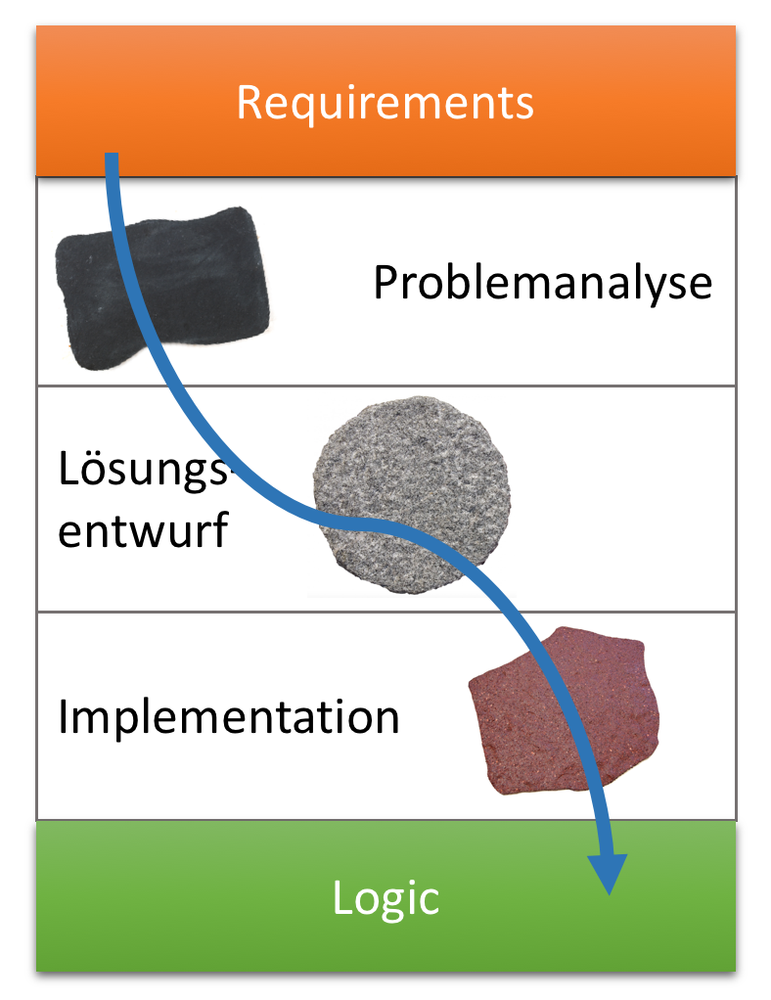
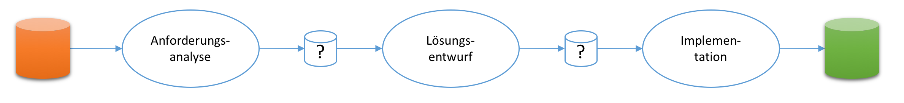
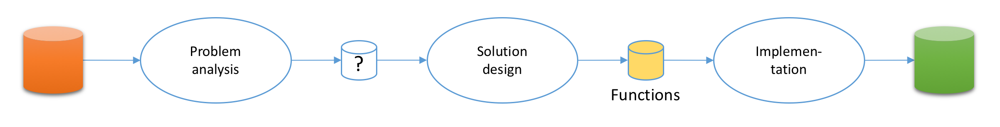
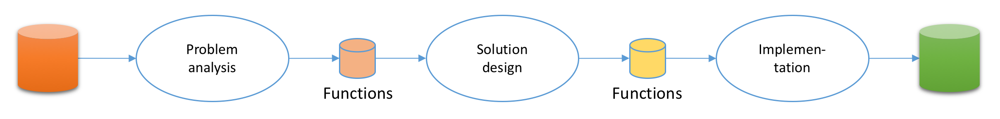
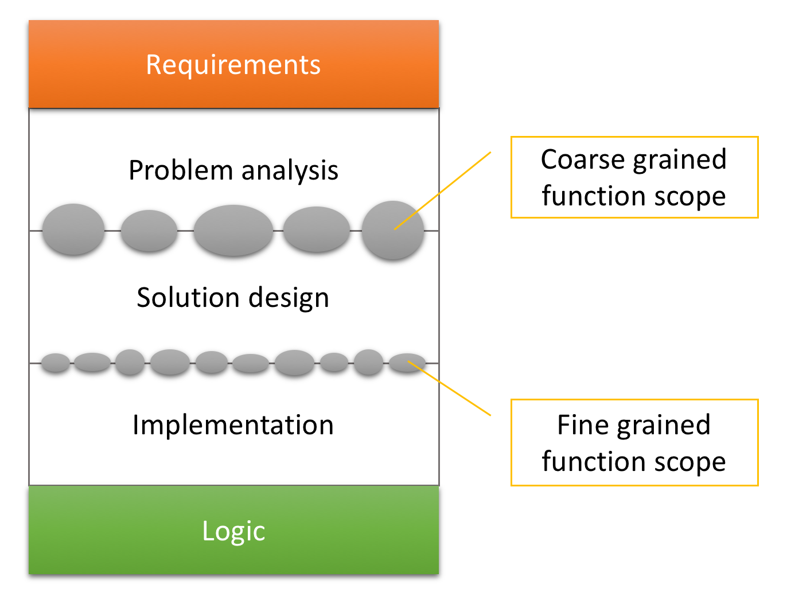
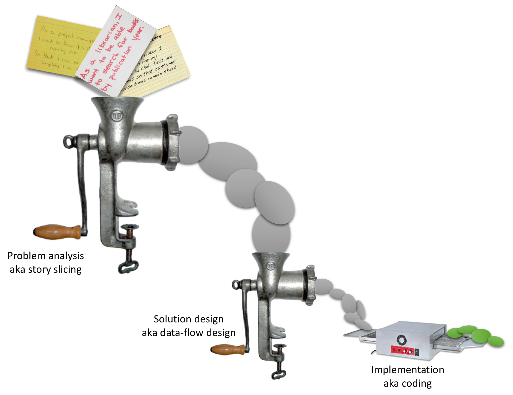

# Schritte zur Überwindung der Lücke
Die [Requirements-Logic-Gap](README.md) ist groß und weit. Unterschätze sie nie! Der Aufwand, sie zu überwinden, ist im Grunde immer größer, als du zunächst denkst.

Wie kannst du dir es aber einfacher machen? Wie könnten Trittsteine platziert sein, um dir den Weg von den Anforderungen zur [Logik](logik.md) leichter zu machen. Kleine und große Schritte sind ok, einen Spagat oder gar ein Sprung solltest du vermeiden.

Zunächst standen wir auch nur vor dieser Lücke und waren ratlos. Zwar hatten wir sie unzählige Male überwunden... doch uns war nicht wirklich, wirklich klar, wie wir das geschafft hatten. Es war mehr Durchwurschteln als präzise Arbeit entlang eines klaren Weges, mehr Auto Scooter als Zugfahrt.

Dabei war zumindest der grobe Weg schon jahrzehntelang ausgeschildert. Er besteht aus drei Abschnitten: Analyse, Entwurf und Implementation.



Das ist nicht neu für dich, oder? Wir kannten diese Abschnitte auch. Im Grunde kann sie sogar niemand umgehen. Aber man kann sich ihrer auf dem Weg zur Logik mehr oder weniger bewusst sein. Man kann sie mit _trial and error_ durchstolpern oder systematisch durchschreiten.

* Alles beginnt mit der Problemanalyse. Am Anfang steht das Verstehen. Wer die Aufgabe nicht versteht, kann keine Lösung entwickeln. Das sollte auf der Hand liegen. Und irgendwie bemüht sich jeder Entwickler auch darum.
* Wenn man das Problem verstanden hat, dann kann man sich überlegen, die eine Lösung _aussehen_ sollte. Man macht sich einen Plan der Lösung, aber baut sie noch nicht. Das ist ein Schritt, über den viel diskutiert wird (Stichworte Architektur, Entwurf), der jedoch vielen Entwickler sehr schwer fällt. Hier ist die Unsicherheit nach unserer Beobachtung sehr groß. Immer wieder wird gesprungen, denn geschritten.
* Schließlich setzt man den Plan um in Code. Das ist der Schritt, den die meisten Entwickler am liebsten tun. Oder wie geht es dir? Hier kommen Programmiersprachen und andere Technologien endlich zum Einsatz. Das ist 'was für echte Programmierer. Darüber kann man sich in der Community die Köpfe heiß reden.

So weit, so einfach. Vielleicht fühlst du dich ertappt, diese Abschnitte im Programmieralltag nicht deutlich von einander zu trennen. Doch irgendwie kanntest du sie schon.

Dann lass uns weitergehen und überlegen: Was sind die Ergebnisse der Arbeit in den Abschnitten?

## Phasenübergänge
Die Wegabschnitte von den Anforderungen bis zur Logik kannst du auch als Phasen eines Transformationsprozesses ansehen.

Der Gesamtprozess der Softwareentwicklung transformiert Anforderungen in Logik. Aber in was werden Anforderungen in der ersten Phase, der Anforderungsanalyse transformiert? Und was ist das Ergebnis des Entwurfs? Dass die letzte Phase Logik als Output generiert, ist klar.



### Die Entwurf:Implementation-Schnittstelle
Fangen wir von unten/hinten an. Die Implementation ist dir bestimmt am vertrautesten. Wie könnte der Input aussehen, um die Implementation möglichst einfach zu machen?

Die Implementation setzt natürlich Anforderungen um. Es muss also ein gewisser Scope an gewünschter Funktionalität bzw. Effizienz anliegen, für den [Logik](logik.md) zu finden ist. Der [Lösungsentwurf](entwurf.md) liefert ja nicht die Logik selbst, sondern nur einen Rahmen, in den nun die Implementation Logik gießen soll.

Wie du im [Experiment](README.md) selbst bemerkt hast, ist es schon für einen kleinen Scope nicht ganz leicht, die Logik zu bestimmen. Das bedeutet: Der [Entwurf](entwurf.md) muss der Implementation Scope in sehr kleinen Happen zur Transformation in Logik liefern.

Aus unserer Sicht schießt sich die Softwareentwicklung immer wieder selbst in den Fuß, indem sie versucht, für zu großen Scope zur Logik zu springen. Das ist auch kein Wunder, wenn der Fokus ständig auf der Implementationsphase liegt; es wird nur ungenügend vorbereitende Arbeit geleistet.

Deshalb wollen wir es ganz klar machen: Der Implementation muss umzusetzender Scope von sehr kleinem Umfang geliefert werden. Im Grunde muss die Logik sogar auf der Hand liegen für den jeweiligen Scope.

Und wie liefert der Entwurf diese Scope-Happen ab? In Form von Funktionssignaturen.



Ja, der Output des Lösungsentwurfs ist eine Menge von Funktionsdefinitionen. Und zwar Funktionen mit sehr, sehr überschauberer Verantwortlichkeit.

Die Implementation ist dann für die exakte programmiersprachliche Umsetzung der Funktionsdefinitionen zuständig. Nur die Implementation codiert! Bei ihr geht es wirklich um die Feinheiten, syntaktische wie technologische.

Der [Entwurf](entwurf.md) liefert insofern vor allem Bedeutungen. Denn das ist es, was Funktionen tun: sie geben Logik Bedeutung.

Was ist die Aufgabe dieser Logik?

```
var values = new List<int>();
for(var i=1; i<=n; i++)
	if (i % 2 == 0)
		values.Add(i);
```

Um das herauszufinden, musst du schon genau hinschauen. Du musst alle Anweisungen betrachten und im Kopf simulieren. Dann kommst du darauf, was in `values` gesammelt wird. Logik selbst ist nur der Ausdruck eines _Wie_. _Was_ das soll, sagt Logik selbst nicht as.

Würde die Logik hingegen in einer Funktion stehen, bräuchtest du sie nicht zu analysieren. Die Funktionssignatur würde dir sagen, worum es bei der Logik geht. Insbesondere der Funktionsname drückt das _Was_, den Zweck, die Verantwortlichkeit aus:

```
IEnumerable<int> Compile_even_numbers(int n) {
	var values = new List<int>();
	for(var i=1; i<=n; i++)
		if (i % 2 == 0)
			values.Add(i);
	return values;
}
```

Jetzt kannst du die Logik im Grunde überspringen, wenn du auf die Funktion in einer Code-Datei stößt. Der Funktionsname sagt, _was_ passiert. Die Logik schaust du nur an, wenn du daran interessiert bist, _wie_ das Verhalten hergestellt wird.

Das Ergebnis des Entwurfs ist also primär eine Liste von Signaturen wie `IEnumerable<int> Compile_even_numbers(int n)`. Dazu können dann gern auch noch Testfälle kommen, um genauer zu definieren, was die Leistung der Funktion sein soll.

Signaturen definieren den syntaktischen Kontrakt von Logik, Tests den semantischen.

Für dich als Programmierhandwerker ist dann sehr klar, was zu tun ist. Entweder fällt dir die Logik dazu tatsächlich gleich ein. Oder du näherst dich ihr z.B. mittels Test-Driven Development (TDD) an. Der Scope ist überschaubar. Deshalb glauben wir, dass TDD hier eine geeignete Praktik ist. Der Refactoring-Bedarf wird sich in Grenzen halten.

Und was ist mit der Objektorientierung? Sollte ein Entwurf nicht auch Klassen definieren? Wo sind die?

Auf dem Weg von den Anforderungen zur Logik sind Klassen zunächst zweitrangig. Klassen dienen nicht der Verhaltensherstellung! So einfach ist das. Deshalb tauchen sie bisher nicht auf. Wenn du mehr darüber erfahren willst, lies hier, [wie Flow-Design Klassen einordnet](module.md).

Die Aufgabe von Analyse und Entwurf ist es, den Gesamtscope der funktionalen wie effizienzorientierten Anforderungen in immer kleinere Teile zu zerlegen, so dass am Ende überschaubare Funktionseinheiten stehen, deren Implementation für dich im Grunde ein no-brainer ist. Wenn zwischen den ursprünglichen Anforderungen und der Logik eine große Lücke, gar ein Graben liegt, dann trennt die Funktionsdefinition des Entwurfs und die Logik nur noch ein dünner Riss. Den kannst du vergleichsweise leicht schließen.

### Die Analyse:Entwurf-Schnittstelle
Der Entwurf stellt Funktionsdefinitionen her. Wie er das unserer Meinung nach tun sollte, wollen wir an dieser Stelle noch nicht diskutieren. Wichtiger ist die Frage, woraus er sie herstellt. Was transformiert der Entwurf, was ist sein Input?

Es ist ganz einfach: Der Entwurf hat wie die Implementation als Ausgangsbasis Funktionsdefinitionen. Die [Problemanalyse](analyse.md) liefert Scope-Happen, die sich mit jeweils einer Funktion repräsentieren lassen.



Der Scope der Funktionen, die der Entwurf transformiert, ist natürlich umfangreicher als der der Funktionen, mit denen die Implementation gefüttert wird. Doch die Form, wie der Scope dem Entwurf von der [Analyse](analyse.md) dargeboten wird, ist dieselbe: Signaturen. Signaturen und Testfälle.

Denn auch hier gilt: Am Ende soll Logik hergestellt werden. Logik braucht Bedeutung. Funktionen stiften Bedeutung. Deshalb sind sie die Liefereinheiten der Phasen Analyse und auch Entwurf.



Wenn ein Softwareentwurf Funktionsdefinitionen enthält, kommt dir das wahrscheinlich nicht allzu besonders vor. Dass jedoch schon die Problemanalyse Funktionsdefinitionen liefern soll, wirst du merkwürdig finden. Product Owner sind keine Programmierer, leisten doch aber Anforderungsanalyse. Sollen die zukünftig statt User Stories (oder Use Cases) Funktionsdefinitionen auf Kärtchen schreiben und an ein Scrum/Kanban Brett hängen?

Nein, ganz so soll es nicht sein. Keine Sorge, Product Owner müssen weiterhin keine Ahnung von Programmierung haben. Verständnis für die Besonderheiten der Softwareentwicklung schaded jedoch nie. Denn da gibt es einige. Aber das ist auch ein anderes Thema.

Wie soll das gehen mit Product Ownern? Das geht, weil Product Owner die Analyseergebnisse nicht allein herstellen, sondern in Zusammenarbeit mit Programmierern. Und das geht, weil Product Owner durch eine [Analysemethode](analyse.md) geleitet werden, die ihre Sprache spricht - und gleichzeitig die Sprache der Programmierer.

Warum überhaupt Funktionen als Analyseergebnis? Weil Funktionen für Programmierer klar definierte Ausgangspunkte sind, um zu Logik zu kommen. Sobald eine Signatur und womöglich sogar Testfälle vorliegen, haben Programmierer etwas, an dem sie mit ihrem Hauptwerkzeug Programmiersprache ansetzen können. Signaturen sind konkret.

Anforderungen ohne Signatur oder zumindest einem Kontrakt, aus dem sich eine Signatur leicht ableiten lässt, sind demgegenüber schwammig. Die Softwareentwicklung kommt mit solchen Anforderungen leicht ins Schlingern. Sie muss dann erst wieder in die Analyse einsteigen. Und was soll dann das Ergebnis dieser Analyse sein?

Wenn wir nicht Funktionsdefinitionen als Ergebnis der Analyse festlegen, drehen wir uns im Kreis. Wir kommen nicht weiter in Richtung Logik.

Und was ist mit den User Stories der Agilität? Die haben ihren Wert. Wenn ein Product Owner User Stories schreiben mag, soll er das tun. Nur sollte weder er noch die Programmierung annehmen, damit sei die Anforderungsanalyse abgeschlossen. Bevor es mit der Implementation, ja, sogar bevor es mit dem Entwurf losgehen kann, muss weitere [Analyse](analyse.md) bzw. Konkretisierung stattfinden. Darum geht es uns im Flow-Design.

### Und was ist mit den Daten?
Funktionen, Funktionen, Funktionen... Und was ist mit den Daten? Wir würden verstehen, wenn du vermisst, dass wir auch mal etwas über Datenstrukturen bzw. Datentypen sagen.

Keine Sorge, beim Flow-Design kommen die Daten nicht zu kurz. Insbesondere im [Entwurf](entwurf.md) spielen sie eine zentrale Rolle - allerdings vielleicht anders, als du denkst.

Warum sie beim Überqueren der Requirements-Logic-Gap kaum Erwähnung finden, wiederholen wir aber gern nochmal: Der Kunde interessiert sich für Verhalten. Der will Action sehen. Im Mittelpunkt steht also die Tat, das Verb, nicht die Struktur, nicht das Substantiv.

Deshalb steht für uns das, was in einer Programmiersprache etwas tut, im Mittelpunkt. Auf unterster Ebene ist das die [Logik](logik.md).

Um Logik aber auch zur Entwicklungszeit schon eine Bedeutung zu geben, braucht es Funktionen. Fehlen die oder werden sie schlecht "geschnitten", muss Logik von dir immer wieder interpretiert, d.h. im Kopf simuliert werden, um zu verstehen. Das ist zeitaufwendig. Und das führt wiederum zum Entstehen vieler Kommentare, die die Abwesenheit von Funktionen kompensieren sollen – aber die Situation noch schlimmer machen. Denn Kommentare verrauschen Code und leisten Inkonsistenzen Vorschub.

Aber natürlich braucht Logik Daten. Sinn und Zweck von Logik ist die Transformation von Daten und dann die Erzeugung von Seiteneffekten. Logik und Daten sind wie Yin und Yang, wie Tag und Nacht, wie Kopf und Adler. Sie gehören unauflöslich zusammen. Logik und Daten stellen die fundamentale Dualität der Softwareentwicklung dar.

Deshalb hat Flow-Design natürlich eine Meinung zum Umgang mit Daten und zum Aufbau von Datenstrukturen. Nur steht die nicht gleichberechtigt im Vordergrund neben unserer Meinung zu Funktionen. Denn der Einstieg in die Entwicklung einer Software ist aus unserer Sicht viel, viel leichter und natürlicher, wenn du dich auf Aktivitäten bzw. Prozesse konzentrierst - und erst dann überlegst, womit diese Prozesse arbeiten.

## Durch den Fleischwolf
Der ganze Weg durch die Requirements-Logic-Gap gleicht einem mehrstufigen Verarbeitungsprozess, bei dem Anforderungen durch den Fleischwolf gedreht werden:



Am Anfang sind sie noch sehr grob - selbst wenn sie als User Stories vorliegen -, dann nimmt sie die [Problemanalyse](analyse.md) in die Mangel. Sie schneidet sie feiner und feiner, bis am Ende einzelne Funktionen heraustropfen.

Jetzt der [Lösungsentwurf](entwurf.md), der den Scope der Funktionen von der Analyse nochmal feiner hackt. Das Resultat sind wiederum Funktionen, nur eben mit weitaus begrenzterem Scope.

Und schließlich die Implementation, die die Funktionen des Entwurfs nimmt und mit Logik füllt.

Fertig ist die Software mit Verhalten.

Ist das ein plastisches Bild? Wir hoffen es.

## Agile Lückenüberwindung
Du hast nun einen Überblick, wie Flow-Design den Programmierprozess differenziert betrachtet. Der besteht aus sequenziellen Phasen. Das finden wir natürlich und vermeidbar. Niemand kann implementieren, ohne vorher (!) die Anforderungen analysiert zu haben. Und was soll überhaupt implementiert werden? Anforderungen werden nicht implementiert. Lösungen werden implementiert. Damit das geschehen kann, müssen sie aber ebenfalls vor (!) der Implementation entwickelt worden sein.

Du siehst, es führt nichts an der Reihenfolge dieser drei Schritte vorbei:

1. Problemanalyse
2. Lösungsentwurf
3. Implementation

Leider wird der Unterschied zwischen Lösungen und Code nicht häufig diskutiert. Es herrscht wohl die Meinung vor, dass Code die Lösung sei. Doch so unvermeidbar am Ende Code oder vor allem Logik als Resultat der Softwareentwicklung ist, so ist doch Code eben nicht die Lösung, sondern nur ihre Manifestation.

Lösungen sind stets konzeptionell. Sie existieren im Kopf. Es sind mentale Modelle von dem, was später in Form von Code zur Laufzeit ein bestimmtes Verhalten erzeugt.

Jetzt magst du denken, dass diese Schrittfolge sehr nach dem viel gescholtenen Wasserfall-Vorgehensmodell aussieht. Und damit hast du insofern recht, als dass beim Wasserfall auch explizit Phasen durchlaufen werden.

Wir sehen in solchen sequenziellen Phasen jedoch keinen Widerspruch zum agilen iterativen Vorgehen. Auch Agilität hebt die Notwendigkeit eines Entwurfs vor der Implementation und einer Analyse vor dem Entwurf nicht auf.

Was Agilität jedoch anders macht als der ominöse Wasserfall, das ist Erhöhung der Frequenz, mit der diese Phasen durchlaufen werden.

Beim Wasserfall soll das nur einmal geschehen: es wird nur einmal alles analysiert, dann ein Gesamtentwurf einmalig angefertigt und schließlich der ganze Entwurf einmal implementiert. Fertig ist die komplette Software.

Eine der zentralen Erkenntnisse der Agilität ist es, dass das eben nicht funktioniert. Dafür gibt es in den Anforderungen zu viele Unklarheiten, die sich nicht durch Nachdenken und Diskutieren ausräumen lassen. Erst der Umgang des Kunden/Anwenders mit laufender Software zeigt, was nicht korrekt angefordert oder analysiert oder entworfen oder implementiert wurde.

Das bedeutet, es muss häufiger, viel häufiger der Weg von den Anforderungen zu lauffähigem Code zurückgelegt werden. Jedes Mal können dabei Erkenntnisse einfließen, die aus der vorherigen Auslieferung gewonnen wurden.

Das ist iterative Entwicklung.

Doch wir wird innerhalb jeder Iteration gearbeitet? Genauso wie beim Wasserfall. Innerhalb einer Iteration werden Anforderungen analysiert, dann wird entworfen, am Ende wird implementiert.

Unsere Beschreibung des Weges zur Überwindung der Requirements-Logic-Gap macht es nur ganz explizit, was dabei wie geschehen soll. In einem Vorgehensmodell wie Scrum ist das nicht erklärt. Scrum ist es sogar egal, wie Entwickler mit den beim Sprint Planning Meeting "übergebenen" Anforderungen in Form von User Stories verfahren. Hauptsache beim Sprint Review am Ende einer Iteration kann lauffähige Software ohne "Verhaltensauffälligkeiten" gezeigt werden.

Trotz einer genauen Vorstellung von der Entwicklung von Logik aus Anforderungen ist Flow-Design also nicht wider die Agilität. Im Gegenteil! Wir stoßen immer wieder auf Belege, dass Agilität gar nicht ihr ganzes Versprechen einlösen kann, solange die Entwicklung nicht in ähnlicher Weise systematisch an User Stories herangeht.

Natürlich haben wir diese Phasen nicht erfunden. Sie sind so alt wie die Softwareentwicklung. Nur ist das irgendwie in weiten Teilen der Softwareentwicklergemeinde vergessen worden. Man durchläuft sie nicht explizit; stattdessen ist Durchwurschteln.

Eines scheint Flow-Design jedoch eigen zu sein: Die Betonung von Funktionen als Liefergegenstand von Analyse und Entwurf.

Und auch wie wir meinen, dass du an Analyse und Entwurf herangehen solltest, scheint neu bzw. kein Thema für den Mainstream.

Und nun kommst du: Wie willst du Flow-Design weiter erkunden?

* Interessiert dich, wie wir den Weg sehen, um von Anforderungen zu Funktionsdefinitionen zu kommen, die dem Entwurf übergeben werden? Dann lies weiter bei der [Problemanalyse](analyse.md)...
* Oder möchtest du erfahren, wie wir Softwareentwurf verstehen, wo doch die mainstream Objektorientierung dazu alles schon seit Jahrzehnten gesagt haben sollte? Dann lies weiter beim [Lösungsentwurf](entwurf.md)...
* Vielleicht bist du aber auch der hands-on Typ, der nach so viel Theorie jetzt mal Code sehen will. Dann schau dir an, was wir zur [Implementation](implementation.md) der vom Entwurf gelieferten Funktionsdefinitionen zu sagen haben...
